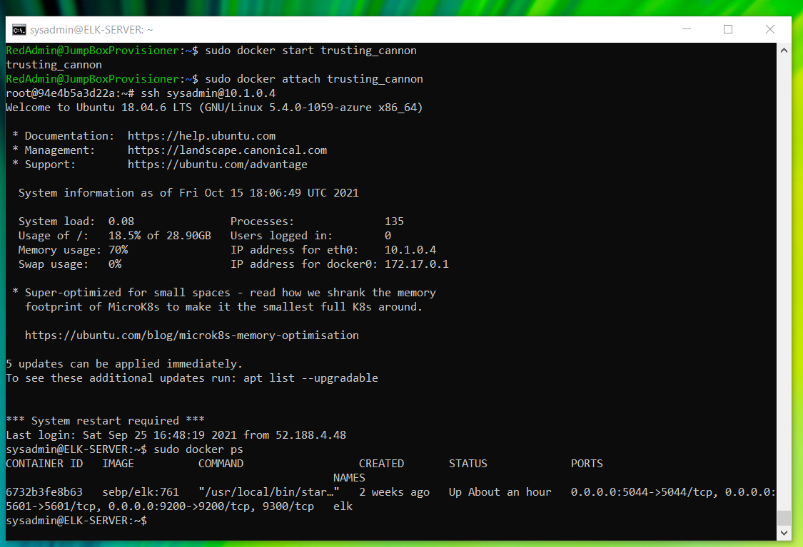

## Automated ELK Stack Deployment

The files in this repository were used to configure the network depicted below.

These files have been tested and used to generate a live ELK deployment on Azure. They can be used to either recreate the entire deployment pictured above. Alternatively, select portions of the playbook file may be used to install only certain pieces of it, such as Filebeat.

  C:\Users\hnaim\scripts\Ansible\elk.yml
  C:\Users\hnaim\scripts\Ansible\filebeat.yml
  C:\Users\hnaim\scripts\Ansible\metricbeat.yml

This document contains the following details:
- Description of the Topologu
- Access Policies
- ELK Configuration
  - Beats in Use
  - Machines Being Monitored
- How to Use the Ansible Build

### Description of the Topology

The main purpose of this network is to expose a load-balanced and monitored instance of DVWA, the D*mn Vulnerable Web Application.

Load balancing ensures that the application will be highly available, in addition to restricting access to the network.

- Load balancing is great for increasing availability of a service, appplication, website, etc. It is used to distrubute network traffic amongst multiple servers as well as restrict access to the network. This ensures that no single server is overloaded with requests and also improves performace as the load is equalized. In particular, load balancing can be a very big difference maker in DoS attacks. If one server is bombarded by requests in a DoS attack against an online retailer for example, the load of those requests will be distributed amongst the other servers in their network. Even in the midst of an attack, the website will remain functional as the DoS attack wasn't able to successfully 'overload' a single primary server.  

- The advantage of using the Jump Box is that administrators are required to pass through it for all administrative actions to be made. This machine can be considered a Secure Admin Workstation (SAW) since any administrative tasks cannot be fulfilled until the Jump Box is accessed. 

Integrating an ELK server allows users to easily monitor the vulnerable VMs for changes to the log files and system metrics.

- Filebeat is a lightweight shipper used for centralizing and forwarding logs. It can monitor locations and log files specified by the user
- Metricbeat is used to collect metric data, such as memory, cpu, or data related to running services on the server. It also is used to monitor other beats and even ELK stack itself.

The configuration details of each machine may be found below.

| Name     | Function | IP Address | Operating System |
|----------|----------|------------|------------------|
| Jump Box | Gateway  | 10.0.0.4   | Linux            |
| Web-1    | Server   | 10.0.0.5   | Linux            |
| Web-2    | Server   | 10.0.0.6   | Linux            |
| ELK VM   | Monitor  | 10.1.0.4   | Linux            |

### Access Policies

The machines on the internal network are not exposed to the public Internet. 

Only the JumpBox machine can accept connections from the Internet. Access to this machine is only allowed from the following IP addresses:

- Admin's local IP address via SSH 

Machines within the network can only be accessed by Port 22 (SSH).

- The JumpBox-Provisioner is the only machine that has access to the machines within the network, which is why it is referred to as the 'gateway' in the table above. It's IP address is 10.0.0.4

A summary of the access policies in place can be found in the table below.

| Name     | Publicly Accessible | Allowed IP Addresses |
|----------|---------------------|----------------------|
| Jump Box |        Yes          |    Admin local IP    |
| Web-1    |No, via JumpBox only |      10.0.0.1        |
| Web-2    |No, via JumpBox only |      10.0.0.1        |
| ELK      |No, via JumpBox only |      10.0.0.1        |

### Elk Configuration

Ansible was used to automate configuration of the ELK machine. No configuration was performed manually, which is advantageous because:

- The configuration and/or update of multiple machines simultaneously is a process that is significantly simplified as opposed to doing it manually for each machine. Any changes that need to be implemented can be added or edited within the ansible playbook file. Once ran, the playbook file will deploy those changes to every machine that is configured with that playbook. Not only does process exponentially save time, it also significantly reduces the margin of error as all machines will be running off of the same playbook file, rather than risking human error while configuring each machine individually.

The playbook implements the following tasks:

- Install docker.io
- Install python-pip3
- Install docker python module
- Use more system memory
- Download and launch a docker elk container
- Enable docker service on boot

The following screenshot displays the result of running `docker ps` after successfully configuring the ELK instance.

### Target Machines & Beats
This ELK server is configured to monitor the following machines:

- Web-1 (10.0.0.5)
- Web-2 (10.0.0.6)

We have installed the following Beats on these machines:

- Filebeat
- Metricbeat

These Beats allow us to collect the following information from each machine:

- Filebeat collects file system data. It is useful in detecting any changes that could be made on specific important files. These logs are also time-stamped, so the user will know when the change occurred. For example, if a hacker gains access to the /etc/passwd file and attempts to make a change, those actions will be logged and sent to Elasticsearch within the ELK machine. 
- Metricbeat is used for gathering operational metrics and statistics about the machine being monitored. Some examples of metricbeat monitoring include CPU usage, memory, status of running services, etc. Metricbeat will collect this data and ship it to the destination specified by the user, for example, Elasticsearch. 

### Using the Playbook
In order to use the playbook, you will need to have an Ansible control node already configured. Assuming you have such a control node provisioned: 

SSH into the control node and follow the steps below:
- Copy the playbook file to /etc/ansible.
- Update the hosts file to include Web-1, Web-2, and ELK IP addresses
     (10.0.0.5, 10.0.0.6, 10.1.0.4)
- Run the playbook, and navigate to http://10.1.0.4:5601 to check that the installation worked as expected.

- _Which file is the playbook? Where do you copy it?_

  - The playbook files are elk.yml, filebeat.yml, and metricbeat.yml. All of these files should be copied into the /etc/ansible folder.

- _Which file do you update to make Ansible run the playbook on a specific machine? How do I specify which machine to install the ELK server on versus which to install Filebeat on?_

  - The hosts file is updated to include the IP's of Web-1, Web-2, and the elk server. Adding 'elk' or 'webservers' at the end of your playbook command will specify which machine the installation is intended for.

- _Which URL do you navigate to in order to check that the ELK server is running?

  - After running the playbook command, navigate to http://10.1.0.4:5601 to confirm that the installation was successful.

_As a **Bonus**, provide the specific commands the user will need to run to download the playbook, update the files, etc._